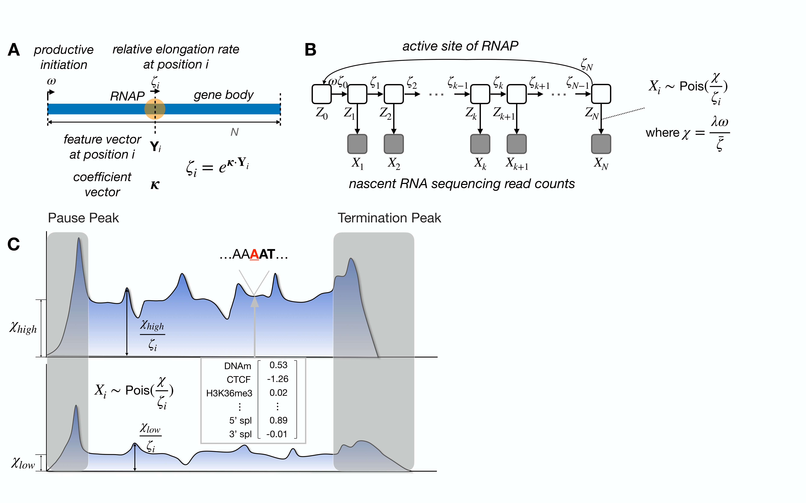

# Probabilistic and machine-learning methods for predicting local rates of transcription elongation from nascent RNA sequencing data

## Overview
In this study, we revisit the questions about the determinants of local elongation rates through gene bodies using a fundamentally different statistical modeling approach.  Our method is based on a recently developed "unified model" for nascent RNA sequencing (NRS) data, which describes both the kinetics of Pol II movement on the DNA template and the generation of NRS read counts (see [Siepel 2022](https://www.biorxiv.org/content/10.1101/2021.01.12.426408v1) and [Zhao et al 2023](https://academic.oup.com/nar/article/51/21/e106/7331020)). 

We adapt this model to allow for a continuously variable elongation rate along the genome, using a generalized linear model to capture the relationship between the local rate and nearby genomic features (see [Liu et al 2023](https://www.biorxiv.org/content/10.1101/2023.12.21.572932v1)). By accounting for differences across genes in initiation rate, we are able to efficiently pool information across genes, and extract high-resolution information about relative local elongation rates from steady-state data. 

Here, we provide scripts of the implementation, and demonstrate how quantify both previously known and novel correlates of elongation rate through estimation of coefficients $\kappa$. We then use our models to predict nucleotide-specific elongation rates $\zeta_i$ genome-wide and make our predictions available in a UCSC Genome Browser track.

<p align="center">
  
</p>

<p align = "left">
	Fig. 1 Conceptual illustration of kinetic model for Pol II movement along DNA template in gene body. At nucleotide site $i$, relative elongation rate $\zeta_i$ is an exponentiated linear function of features $\vec Y_i$ and coefficients $\kappa$. 
	Promoter-proximal pausing and termination are ignored here. 
	Graphical model representation showing unobserved continuous-time Markov chain ($Z_i$) and observed NRS read counts ($X_i$).
	Conceptual illustration showing that differences in average gene-body read depth are explained by the scaled initiation rate $\chi$, while relative read depth is explained by the generalized linear model for local elongation rate $\zeta_i$. 
	Read count $X_i$ is assumed to be Poisson distributed with mean $\frac{\chi}{\zeta_i}$.
</p>


## Dependencies

GLM is implemented in the statistical programming language [R](https://www.r-project.org/), and depends on a couple of packages. One of the easiest ways to install them is via [conda](https://docs.conda.io/en/latest/).

```
conda env create --file pub_glm_env.yaml
```

Once installed, you can activate the environment then run the examples within it,

```
conda activate pub_glm
```

Data for the examples below can be downloaded from [Galaxy](https://usegalaxy.org/u/lingjie_liu/h/glm-test-data), and should be assumed to be stored within the data directory. 


## Examples

### Estimate coefficients $\kappa$ based on epigenomic model

```
usage: Rscript ./estimate_epigenomic_kappa.R [-h] -i InputFile [-c Category]
                                             [-l_s LearningSize]
                                             [-t Tolerance] [-o OutputDir]

Estimate coefficients kappa of epigenomic model

options:
  -h, --help         show this help message and exit
  -i InputFile       input training set of gene coordination, read counts and
                     covariates
  -c Category        category of input (name of cell line or simulation)
                     [default "simulation"]
  -l_s LearningSize  learning size for gradient ascent [default 1e-07]
  -t Tolerance       tolerance for gradient ascent [default 0.1]
  -o OutputDir       directory for saving the output of kappa
```

**Simulation data** <br>
We first tested our modeling approach on data simulated with [SimPol](https://github.com/CshlSiepelLab/SimPol), which tracks the movement of individual RNA polymerases along the DNA templates in thousands of cells under user-defined rates, and then samples NRS read counts in proportion to the steady-state polymerase density. For this study, we extended SimPol to consider synthetic epigenomic correlates, which we tiled along each synthetic DNA template using a block-sampling approach based on real data for CTCF transcription binding sites, four different histone marks, and RNA stem-loops. The gene coordinates of the simulated gene bodies, the synthetic NRS read counts generated by SimPol, and the simulated feature covariates are merged together. 80% of this data is used as the training data for estimating $\kappa$, and consequently serves as the input for `estimate_epigenomic_kappa.R`. <br>

The input file `-i` for the simulation analysis looks like below; `seqnames`, `start`, `end`, `strand`, `ensembl_gene_id` are gene coordinates; `score` is synthetic NRS read counts;  the remaining columns are feature covariates. Notably, each feature is standardized to have a mean of zero and a standard deviation of one.
```
# A tibble: 6 × 12
  seqnames start   end strand ensembl_gene_id score ctcf[,1] h3k36me3[,1] dms[,1] h3k4me2[,1] h3k9me3[,1] h4k20me1[,1]
  <chr>    <int> <int> <chr>  <chr>           <int>    <dbl>        <dbl>   <dbl>       <dbl>       <dbl>        <dbl>
1 1            1     1 +      1                   0  -0.0837       -0.341  -0.308      -0.160      -0.538         1.54
2 1            2     2 +      1                   1  -0.0837       -0.340  -0.308      -0.160      -0.539         1.56
3 1            3     3 +      1                   0  -0.0837       -0.338  -0.308      -0.161      -0.539         1.57
4 1            4     4 +      1                   0  -0.0837       -0.337  -0.308      -0.161      -0.539         1.58
5 1            5     5 +      1                   0  -0.0837       -0.335  -0.308      -0.161      -0.540         1.60
6 1            6     6 +      1                   0  -0.0837       -0.334  -0.308      -0.161      -0.540         1.61
```

The choice of `-l_s` for learning rate and `-t` for tolerance is essential to ensure both the sufficiency (precision of $\kappa$) and efficiency (running time) of likelihood convergence in the gradient ascent algorithm. So, the optimal optimial learning rate and tolerance are specified in the command line below for estimating coefficients $\kappa$ in the simulation.
```
Rscript ./estimate_epigenomic_kappa.R -i ../data/simEP_gbrcGaussian_trainOne.Rdata -c simulation -l_s 1e-6 -t 1e-2 
```

While fitting, the proposed log likelihood for each iteration is recorded in the `sim_epigenomic_kappa.log` file.  
After the completion of fitting, the estimated coefficients $\kappa$ are saved in the `sim_epigenomic_kappa.csv` file, with two columns as follows. Both the .log file and the .csv file can be found in the output directory.

```
"feature","kappa"
"H3K36me3",-0.260447787120152
"stem-loop",-0.0553034654846287
"H4K20me1",-0.0467166979577607
"CTCF",-0.0181587606643657
"H3K4me2",0.0341186759406782
"H3K9me3",0.0412922564113079
```

**Real PRO-seq data** <br>
Having established that our model works well with simulated data, we applied it to real PRO-seq data from K562 cells, for which abundant epigenomic data are available. Currently, the epigenomic model of K562 includes twelve features. Therefore, the input format is similar to the input simulation data shown above but with more feature columns. All features are standardized and subjected to smoothing filters designed to capture broader effects that extend to neighboring nucleotide positions centered on the features. In each replicate, we sampled 2000 genes, with 80% of the data serving as the training data, which serves as the input. One replicate is utilized in the command line and executed as an example (fitting can take hours due to the size of the real data).

```
Rscript ./estimate_epigenomic_kappa.R -i ../data/k562_samp_epft_norm_train_1.Rdata -c k562 -l_s 1e-7 -t 1e-1
```
Same as in the simulation analysis, the output should include the the `k562_epigenomic_kappa.log` file and the `k562_epigenomic_kappa.csv` file.


### Estimate coefficients $\kappa$ based on $k$-mer model ($k \in \{1, 2, 3, 4, 5\}$)

```
usage: Rscript ./estimate_kmer_kappa.R [-h] -i InputFile -k_m Inputkmer -k_t
                                       InputkmerTypes [-c Category]
                                       [-l_s LearningSize] [-t Tolerance]
                                       [-p penalty] [-o OutputDir]

Estimate coefficients kappa of k-mer model

options:
  -h, --help           show this help message and exit
  -i InputFile         input training set of gene coordination, read counts
  -k_m Inputkmer       input training set of k-mer sparse matrix
  -k_t InputkmerTypes  types for all kmers (AATTA, AATTT...)
  -c Category          category of input (name of cell line or simulation)
                       [default "simulation"]
  -l_s LearningSize    learning size for gradient ascent [default 1e-07]
  -t Tolerance         tolerance for gradient ascent [default 0.01]
  -p penalty           hyperparameter for L1 penalty, log10(nu) [default -6]
  -o OutputDir         directory for saving the output of kappa
```

**Simulation data** <br>
In addition to epigenomic factors, we extended our generalized linear model to consider the $k$-mer content of the local DNA sequence, initially considering 5-mers only ($k=5$) in simulation. 
The notable difference in the $k$-mer-involved model is the utilization of L1 regularization to limit the number of non-zero coefficients $\kappa$ of the $\sim$ 1000 $k$-mer features. Therefore, the original likelihood function used in the epigenomic model is upgraded to a penalized likelihood in the fitting process.

We tested this approach with data simulated by SimPol, in which 100 randomly-selected 5-mers were assigned negative or positive coefficients and all others were assigned coefficients of zero. At each position $i$, the indicator feature associated with the 5-mer centered at $i$ is set to 1 and the remaining 5-mer indicator features are set to 0. Due to the high-dimensional nature of the $k$-mer feature vectors and the prevalence of zero values for most features across genomic positions, a sparse matrix is used to store the $k$-mer covariates. This method significantly reduces storage requirements and speeds up calculations. The `-k_t` input $k$-mer matrix appears as follows:
```
6 x 1024 sparse Matrix of class "dgCMatrix"
                                                                              
[1,] . . . . . . . . . . . . . . . . . . . . . . . . . . . . . . . . . . . . .
[2,] . . . . . . . . . . . . . . . . . . . . . . . . . . . . . . . . . . . . .
[3,] . . . . . . . . . . . . . . . . . . . . . . . . . . . . . . . . . . . . .
[4,] . . . . . . . . . . . . . . . . . . . . . . . . . . . . . . . . . . . . .
[5,] . . . . . . . . . . . . . . . . . . . . . . . . . . . . . . . . . . . . .
[6,] . . . . . . . . . . . . . . . . . . . . . . . . . . . . . . . . . . . . .
                                                                              
[1,] . . . . . . . . . . . . . . . . . . . . . . . . . . . . . . . . 1 . . . .
[2,] . . . . . . . . . . . . . . . . . . . . . . . . . . . . . . . . . . . . .
[3,] . . . . . . . . . . . . . . . . . . . . . . . . . . . . . . . . . . . . .
[4,] . . . . . . . . . . . . . . . . . . . . . . . . . . . . . . . . . . . . .
[5,] . . . . . . . . . . . . . . . . . . . 1 . . . . . . . . . . . . . . . . .
[6,] . . . . . . . . . . . . . . . . . . . . . . . . . . . . . . . . . . . . .
```
Another input `-i` consists of the gene coordinates and the synthetic NRS read counts, which appear as follows:
```
# A tibble: 6 × 6
  seqnames start   end strand ensembl_gene_id score
  <chr>    <int> <int> <chr>  <chr>           <int>
1 1            1     1 +      1                   0
2 1            2     2 +      1                   0
3 1            3     3 +      1                   0
4 1            4     4 +      1                   0
5 1            5     5 +      1                   0
6 1            6     6 +      1                   0
```

Another input `-k_t` consists of a vector of all types of $k$-mers, which appear as follows:
```
[1] "AAAAA" "TAAAA" "GAAAA" "CAAAA" "ATAAA" "TTAAA"
```

In addition to parameters `-l_s` for learning rate and `-t` for tolerance, an extra parameter `-p` is required for the $k$-mer-involved model, which indicates the application of L1 penalty. The `-p` takes the value of $\log_{10}{\nu}$, where $\nu$ is the hyperparameter for L1 regularization. The optimal $\nu$ of the L1 penalty is determined by cross-validation and is specified in the following command example:
```
Rscript ./estimate_kmer_kappa.R -i ../data/simKmer_gbrc_trainAll.Rdata -k_m ../data/simKmer_kmerMT_trainAll.Rdata -k_t ../data/allmer_types.RData -c simulation -l_s 1e-4 -t 1e-2 -p -5.8
```
This example takes approximately 1 hour to finish the fitting. Similarly, the fitting process is recorded in the `sim_kmer_kappa.log` file, and the estimated $\kappa$ values are saved in the `sim_kmer_kappa.csv` file.

**Real PRO-seq data** <br>
We re-analyzed the PRO-seq data from K562 cells and we allowed for $k$-mers of any length up to and including five nucleotides ($k \in \{1, 2, 3, 4, 5\}$). Standardization of the indicator features for $k$-mers led to a computational problem that required special attention. Prior to standardization, these features had values of zero at the vast majority of genomic positions, but after standardization these zeroes were converted to negative real values. As a result, we addressed this problem by first calculating from the unstandardized sparse matrix and using a linear transformation to convert them to the corresponding values for the standardized features. In this way, the speed of processing the unstandardized values could be maintained while properly considering the effects of standardization. The inputs are similar to the simulation shown above. An example using one replicate of training data is provided in the command line (fitting may take hours due to the size of the real data).

```
Rscript ./estimate_kmer_kappa.R -i ../data/k562_subset1_gbrc_train.RData -k_m ../data/k562_subset1_allmerMT_train.RData -k_t ../data/allmer_types.RData -c k562 -l_s 1e-7 -t 1e-1 -p -3.6
```
Similarly, the fitting process is recorded in the `k562_kmer_kappa.log` file, and the estimated $\kappa$ values are saved in the `k562_kmer_kappa.csv` file.


### Predicted nucleotide-specific elongation rates $\zeta_i$

```
usage: Rscript ./predict_zeta.R [-h] -g GeneBody [-c Category] -r ReadCount
                                [-m Model] -e_m EpMatrix -k Kappa
                                [-k_m KmerMatrix] [-o OutputDir]

Predict nucleotide-specific elongation rate zeta

options:
  -h, --help       show this help message and exit
  -g GeneBody      input of gene coordinates in the predicted regions
  -c Category      category of input (name of cell line) [default "k562"]
  -r ReadCount     input of PRO-seq read counts in the predicted regions
  -m Model         select a model (epigenomic, combined) [default
                   "epigenomic"]
  -e_m EpMatrix    epigenomic covariates in the predicted regions
  -k Kappa         estimated kappa values for epigenomic or combined models
  -k_m KmerMatrix  input of k-mer sparse matrix in the predicted regions
  -o OutputDir     directory for saving the predicted nucleotide-specific zeta
```

**Predict using the epigenomic model** <br>
With the estimated coefficients $\kappa$ for four cell lines (K562, CD14+, HeLa-S3, and MCF-7), we can predict nucleotide-specific elongation rates $\zeta_i$. In the manuscript, we primarily used the epigenomic model and the combined model to predict $\sim$ 3,600 expressed genes shared by these four cell lines, which we then prepared as public [UCSC browser tracks](http://compgen.cshl.edu/elongation-rate-tracks.php). For illustration purposes, we extracted data for two genes (*RPF1* and *ZNF746*) from K562, as shown in Figure 6 of our manuscript.

When predicting with epigenomic models, there are four required input files. 
The `-g` option requires gene coordinates:
```
# A tibble: 6 × 6
  seqnames    start      end width strand ensembl_gene_id
  <fct>       <int>    <int> <int> <fct>  <chr>          
1 1        84481531 84481531     1 +      ENSG00000117133
2 1        84481532 84481532     1 +      ENSG00000117133
3 1        84481533 84481533     1 +      ENSG00000117133
4 1        84481534 84481534     1 +      ENSG00000117133
5 1        84481535 84481535     1 +      ENSG00000117133
6 1        84481536 84481536     1 +      ENSG00000117133
```
The `-r` option requires real NRS read counts from the chosen cell line:
```
# A tibble: 6 × 1
  score
  <dbl>
1     0
2     0
3     0
4     0
5     0
6     0
```
The `-e_m` option requires standardized epigenomic covariates:
```
# A tibble: 6 × 10
  ctcf[,1] h4k20me1[,1] h3k79me2[,1] h3k4me1[,1] h3k9me3[,1] h3k36me3[,1]
     <dbl>        <dbl>        <dbl>       <dbl>       <dbl>        <dbl>
1  -0.0622        0.401      -0.0964       0.884   -0.00173         0.460
2  -0.0621        0.405      -0.0953       0.889   -0.00135         0.452
3  -0.0621        0.409      -0.0943       0.895   -0.000975        0.444
4  -0.0620        0.413      -0.0933       0.900   -0.000598        0.436
5  -0.0619        0.416      -0.0922       0.905   -0.000221        0.427
6  -0.0619        0.420      -0.0912       0.910    0.000156        0.419
# ℹ 4 more variables: sj5 <dbl[,1]>, sj3 <dbl[,1]>, rpts <dbl[,1]>, wgbs <dbl>
```
The `-k` option requires estimated $\kappa$:
```
"feature","kappa","type"
"3' spl",-0.0394968062126368,"k562_original"
"5' spl",-0.025090231062656,"k562_original"
"CTCF",-0.0276861452624072,"k562_original"
"DNAm",-0.204509198172684,"k562_original"
"H3K36me3",-0.108807845029559,"k562_original"
"H3K4me1",-0.0356708965432705,"k562_original"
```
In addition to the input files, the `-c` option requires names of cell lines (`k562`, `cd14`, `mcf7` or `hela`); and the `-m` option accepts either `epigenomic` or `combined` model. Try an example of K562 using the following command:

```
Rscript ./predict_zeta.R -g ../data/shared_gb_twoGenes.Rdata -c k562 -r ../data/k562_rc_twoGenes.Rdata -m epigenomic -e_m ../data/k562_epft_norm_twoGenes.Rdata -k ../data/epKappa_fourCell.csv
```

The output is the predicted local elongation rates saved in the bigwig file as `k562_epigenomic_predZeta.bw`. In with the score column, positive values represent rates on positive strands, while negative values indicate rates on negative strands:
```
GRanges object with 35116 ranges and 1 metadata column:
          seqnames    ranges strand |     score
             <Rle> <IRanges>  <Rle> | <numeric>
      [1]     chr1  84481531      * |  0.895864
      [2]     chr1  84481532      * |  0.896287
      [3]     chr1  84481533      * |  0.896715
      [4]     chr1  84481534      * |  0.897148
      [5]     chr1  84481535      * |  0.897586
      ...      ...       ...    ... .       ...
  [35112]     chr7 149495483      * | -0.663404
  [35113]     chr7 149495484      * | -0.664164
  [35114]     chr7 149495485      * | -0.664926
  [35115]     chr7 149495486      * | -0.665692
  [35116]     chr7 149495487      * | -0.666461
  -------
  seqinfo: 2 sequences from an unspecified genome
```
This bigwig file can be visualized in tools like the UCSC Genome Browser or Gviz, which should appear exactly the same as Figure 6A and 6B in our manuscript.


**Predict using the combined model (epigenomic and $k$-mer features)** <br>
We also predict $\zeta_i$ using a combined model. In this setting, one more input file is required compared to predicting using the epigenomic model. an unstandardized $k$-mer sparse matrix. Additionally, the estimated $\kappa$ should include coefficients of both epigenomic and $k$-mer features.
```
Rscript ./predict_zeta.R -g ../data/shared_gb_twoGenes.Rdata -c k562 -r ../data/k562_rc_twoGenes.Rdata -m combined -e_m ../data/k562_epft_norm_twoGenes.Rdata -k ../data/epAllmerKappa_fourCell.csv -k_m ../data/allmerMT_twoGenes.Rdata
```
With this example command, the output bigwig file should be `k562_combined_predZeta.bw`.


## Citation
Liu, L., Zhao, Y. & Siepel, DNA-sequence and epigenomic determinants of local rates of transcription elongation. 2023. Preprint at [bioRxiv](https://www.biorxiv.org/content/10.1101/2023.12.21.572932v1)

Zhao, Y., Liu, L., Hassett, R. & Siepel, A. Model-based characterization of the equilibrium dynamics of transcription initiation and promoter-proximal pausing in human cells. Nucleic Acids Res 51, 2023

Siepel, A. A unified probabilistic modeling framework for eukaryotic transcription based on nascent RNA sequencing data. 2021. Preprint at [bioRxiv](https://www.biorxiv.org/content/10.1101/2021.01.12.426408v1)
